# 프로젝트 1. 자동화 도구 비교 구현

## 1. 프로젝트 개요

### 1.1 프로젝트 주제

본 프로젝트에서는 **컴퓨터활용능력 1급 모의시험 결과 자동 분류 시스템**을 구현하였다.

Google Form을 통해 제출된 모의시험 점수를 기준으로 합격 여부를 자동으로 판단하고, 결과를 Google Sheets에 기록한 뒤 Discord 채널에 안내 메시지를 전송하도록 설계하였다.

또한 동일한 자동화 워크플로우를 **Make**와 **Zapier** 두 가지 도구를 사용하여 각각 구현하고 비교 분석하였다.

---

## 2. 자동화 대상 업무 정의

### 2.1 기존 업무 방식

컴퓨터활용능력 1급 모의시험 결과를 관리할 경우 다음과 같은 반복 업무가 발생한다.

1. 응시자의 점수를 확인한다.
2. 합격 여부를 판단한다.
3. 결과를 스프레드시트에 기록한다.
4. 응시자에게 결과를 안내한다.

위 과정은 응시 인원이 많아질수록 반복적으로 수행되어야 하며, 실수 발생 가능성 또한 증가한다.

---

### 2.2 자동화 목표

Google Form에 점수가 제출되면 자동으로 합격 여부를 판별하고, 결과를 기록 및 공유함으로써 반복 업무를 최소화하는 것을 목표로 한다.

---

## 3. 워크플로우 설계

### 3.1 전체 흐름

1. Google Form에 이름과 점수를 입력하여 제출한다.
2. 자동화 도구가 새로운 응답을 감지한다.
3. 점수를 기준으로 합격 여부를 판단한다.
4. 결과에 따라 Google Sheets에 기록한다.
5. Discord 채널에 결과 안내 메시지를 전송한다.

---

### 3.2 워크플로우 다이어그램

```text
Google Form 제출
        ↓
점수 확인 (70점 기준)
        ↓
   ┌─────────────┬─────────────┐
   │             │             │
70점 이상     70점 미만
   │             │
   ↓             ↓
합격 시트      불합격 시트
기록           기록
   │             │
   ↓             ↓
Discord      Discord
합격 알림     불합격 알림
```

---

## 4. Make 구현

### 4.1 사용 서비스

* Google Forms
* Google Sheets
* Discord

---

### 4.2 Trigger

**Google Forms – Watch Responses**

Google Form에 새로운 응답이 제출되면 자동화가 시작되도록 설정하였다.
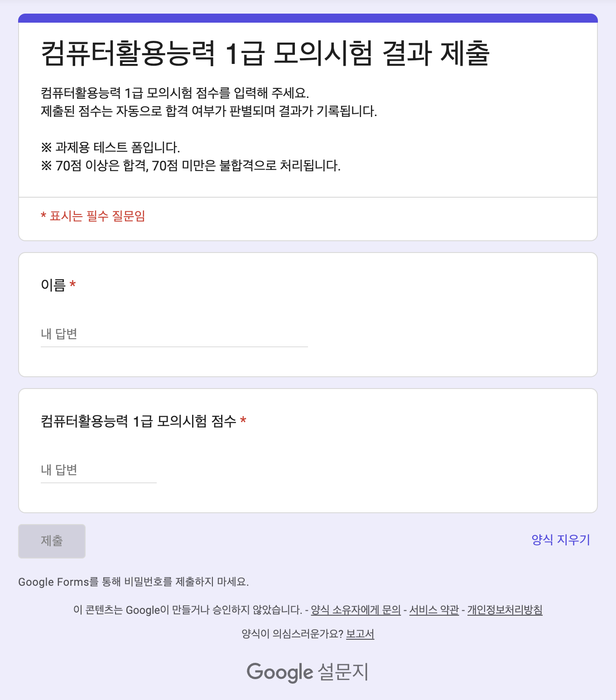
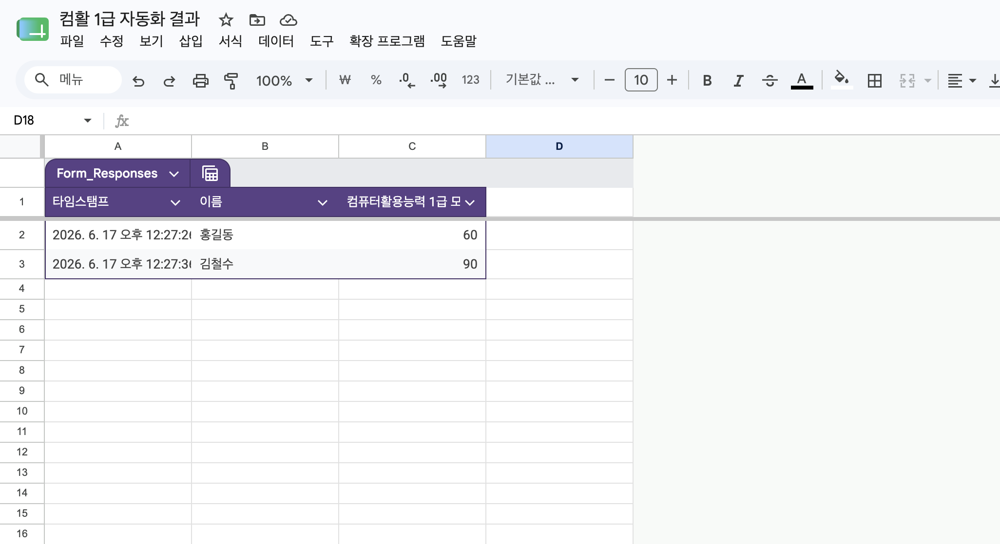

---

### 4.3 Router (조건 분기)

제출된 점수를 기준으로 다음과 같이 분기하였다.

* 점수 ≥ 70점 : 합격 처리
* 점수 < 70점 : 불합격 처리

---

### 4.4 Action

#### (1) 합격 분기

* Google Sheets – Add a Row (합격자 시트 기록)
* Discord – Send a Message (합격 안내)

#### (2) 불합격 분기

* Google Sheets – Add a Row (불합격자 시트 기록)
* Discord – Send a Message (불합격 안내)

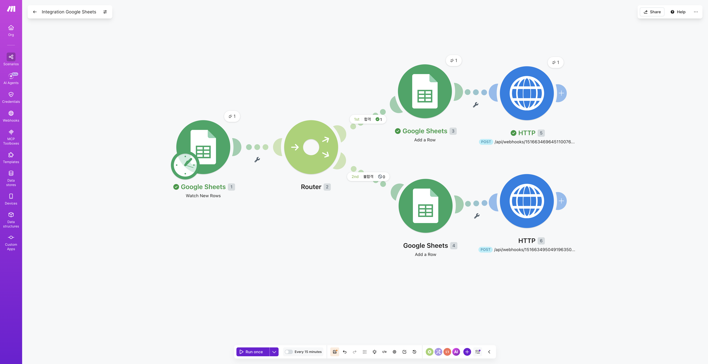

---

### 4.5 구현 화면
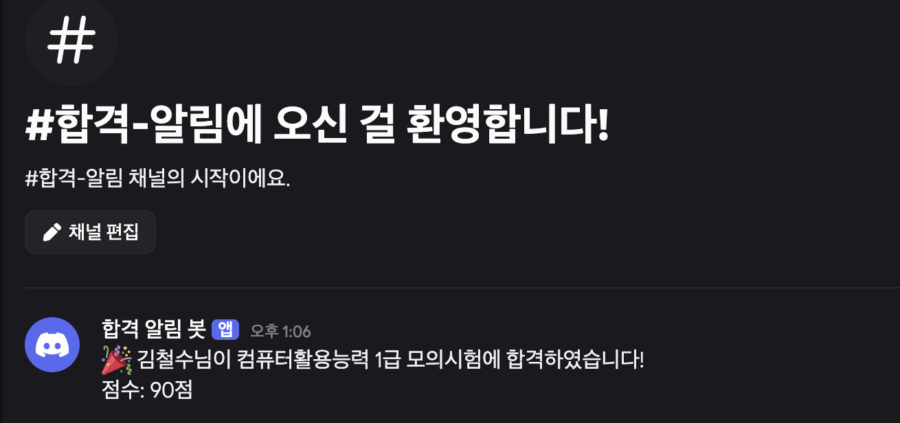

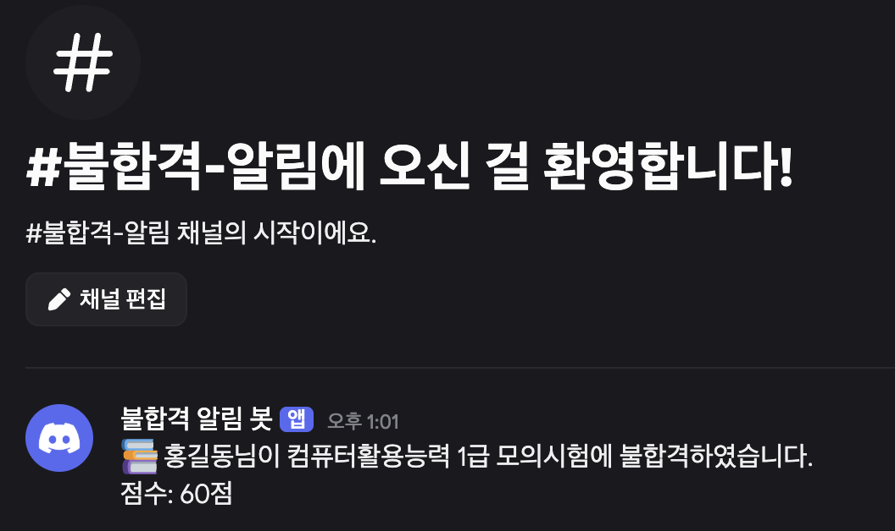


---

## 5. Zapier 구현

### 5.1 사용 서비스

* Google Forms
* Google Sheets
* Discord

---

### 5.2 Trigger

**Google Forms – New Response**

Google Form 응답 발생 시 자동화가 실행되도록 설정하였다.

---

### 5.3 Filter (조건 분기)

점수를 기준으로 다음과 같이 분기하였다.

* 점수 > 69점 : 합격 처리
* 점수 < 70점 : 불합격 처리

---

### 5.4 Action

#### (1) 합격 분기

* Google Sheets – Create Spreadsheet Row
* Discord – Send Channel Message

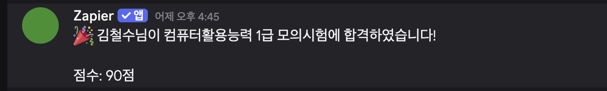

#### (2) 불합격 분기

* Google Sheets – Create Spreadsheet Row
* Discord – Send Channel Message

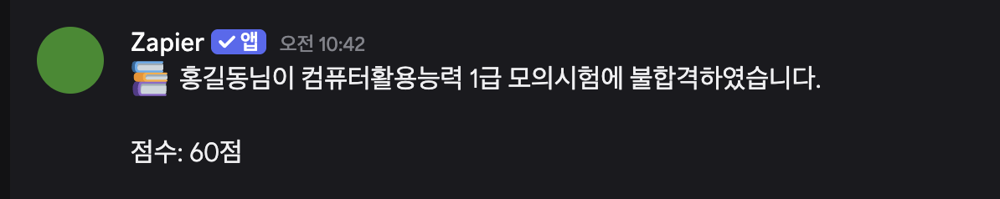

---

### 5.5 구현 화면

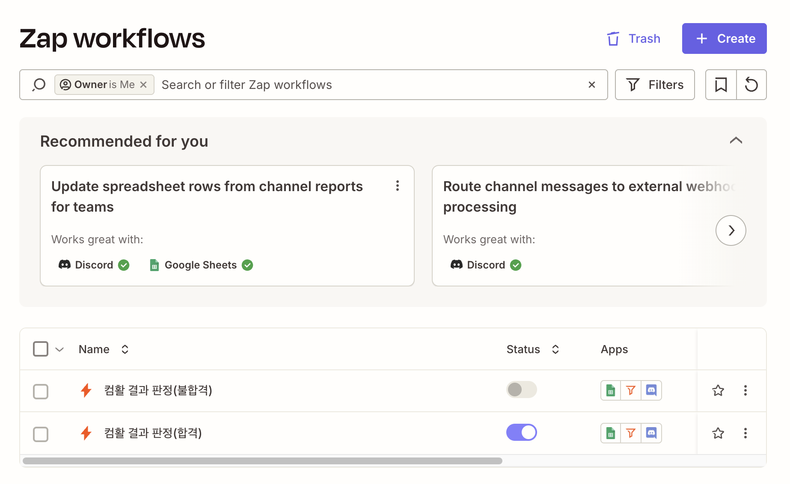

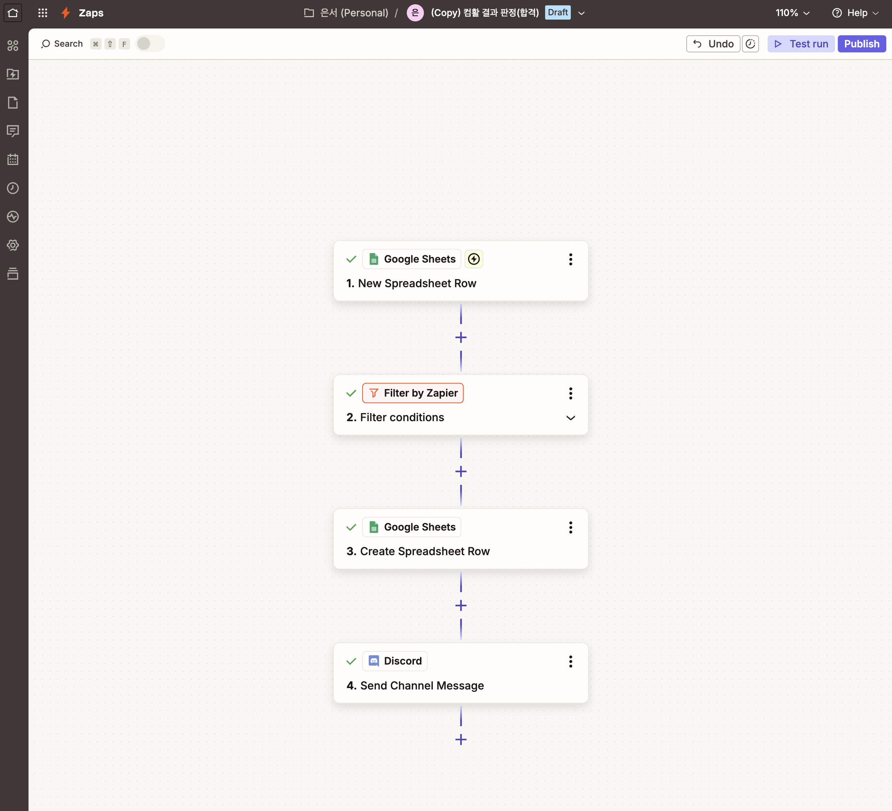

---

## 6. 실행 결과

### 6.1 테스트 케이스 1 (합격)

#### 입력 데이터

* 이름 : 김철수
* 점수 : 90점

#### 실행 결과

* 합격자 시트에 기록
* Discord 채널에 합격 안내 메시지 전송

#### 결과 화면

> [Google Sheets 합격 결과 캡처 삽입]
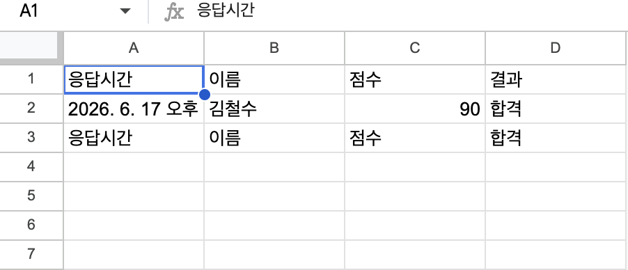
> [Discord 합격 알림 캡처 삽입]
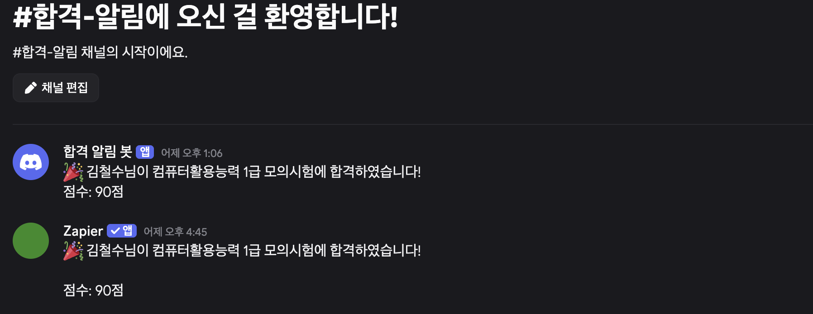
---

### 6.2 테스트 케이스 2 (불합격)

#### 입력 데이터

* 이름 : 홍길동
* 점수 : 60점

#### 실행 결과

* 불합격자 시트에 기록
* Discord 채널에 불합격 안내 메시지 전송

#### 결과 화면

> [Google Sheets 불합격 결과 캡처 삽입]
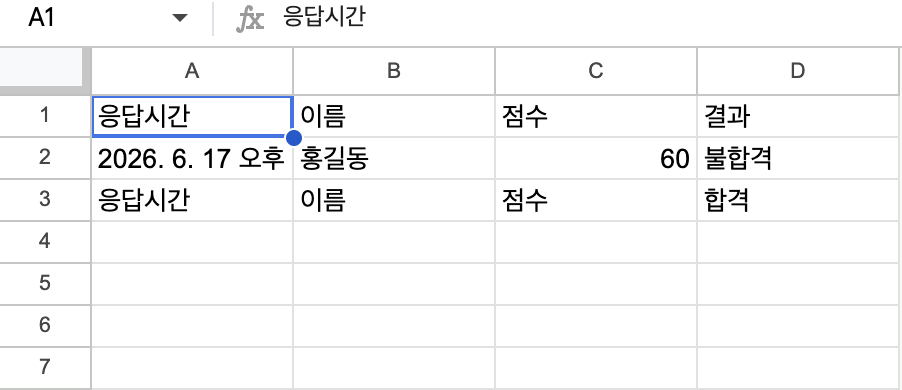
> [Discord 불합격 알림 캡처 삽입]
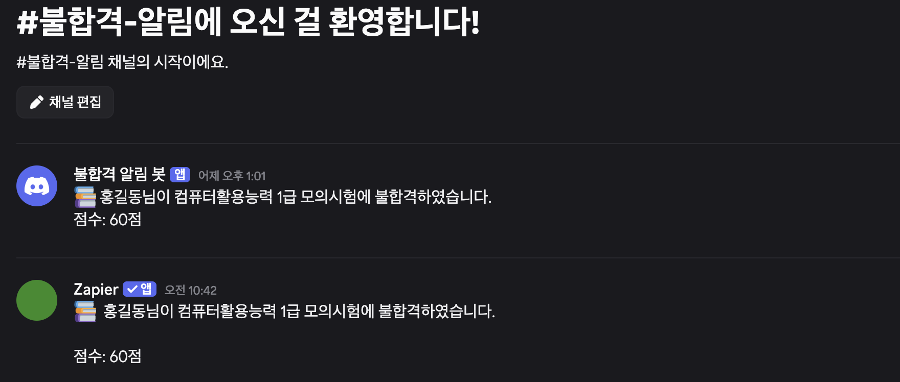
---

## 7. 비교 분석

### 7.1 도구 비교

| 비교 항목       | Make       | Zapier          |
| ----------- | ---------- | --------------- |
| UI/UX       | 시각적인 노드 기반 | 단계별 설정 방식       |
| 설정 난이도      | 초기 학습 필요   | 비교적 직관적         |
| 조건 분기 방식    | Router     | Filter          |
| 무료 플랜 범위    | 비교적 넉넉함    | 제한적             |
| 실행 로그 확인    | 시각적 확인 가능  | Task History 제공 |
| 복잡한 자동화 적합성 | 높음         | 보통              |
| 초보자 접근성     | 보통         | 높음              |

---

### 7.2 장단점

#### Make

**장점**

* 시각적으로 흐름을 확인하기 쉽다.
* 복잡한 분기 구조 설계에 적합하다.

**단점**

* 처음 사용하는 경우 다소 어렵게 느껴질 수 있다.

---

#### Zapier

**장점**

* 단계별 설정 방식으로 직관적이다.
* 자동화를 빠르게 구축할 수 있다.

**단점**

* 무료 플랜의 기능 제한이 존재한다.
* 복잡한 워크플로우 구현 시 불편할 수 있다.

---

## 8. 최종 의견

본 프로젝트를 통해 Trigger, Action, Filter의 개념을 실제 자동화 과정에 적용해 볼 수 있었다.

Make는 시각적인 워크플로우 구성과 다양한 조건 분기에 강점을 보였으며, Zapier는 초보자도 쉽게 사용할 수 있는 직관적인 인터페이스를 제공하였다.

따라서 간단한 자동화에는 Zapier가 적합하며, 복잡한 업무 흐름을 설계해야 하는 경우에는 Make가 더욱 효과적인 도구라고 판단하였다.


## 9. 트리거(Trigger)와 액션(Action)의 차이

자동화 워크플로우는 일반적으로 **트리거(Trigger)** 와 **액션(Action)** 으로 구성된다.

트리거는 자동화를 시작시키는 조건이며, 액션은 트리거 발생 후 실제로 수행되는 작업이다.

즉, 자동화는 다음과 같은 구조를 가진다.

```text
Trigger
 ↓
Action
 ↓
Action
 ↓
Action
```

---

## 트리거(Trigger)

트리거는 자동화를 실행시키는 사건(Event) 또는 조건(Condition)을 의미한다.

즉, **"언제 자동화를 시작할 것인가?"** 를 결정하는 역할을 수행한다.

본 프로젝트에서 사용할 수 있는 트리거의 예시는 다음과 같다.

* GitHub 저장소에 Push 발생
* Pull Request 생성
* Pull Request 병합
* Release 생성
* Issue 등록

예시:

```text
GitHub에 새로운 커밋 Push 발생
↓
자동화 시작
```

위 예시에서 **"Push 발생"** 이 트리거에 해당한다.

---

## 액션(Action)

액션은 트리거가 발생한 후 실제로 수행되는 작업을 의미한다.

즉, **"자동화가 무엇을 수행할 것인가?"** 를 결정하는 역할을 한다.

본 프로젝트에서 수행되는 액션의 예시는 다음과 같다.

* GitHub 변경사항 조회
* 커밋 정보 수집
* 메시지 생성
* Discord 알림 전송
* 실행 로그 저장

예시:

```text
Push 발생
↓
변경사항 조회
↓
Discord 메시지 생성
↓
Discord 채널 알림 전송
```

위 과정에서 "변경사항 조회", "메시지 생성", "Discord 알림 전송"은 모두 액션에 해당한다.

---

## 프로젝트 적용 사례

본 프로젝트의 자동화 흐름은 다음과 같이 구성된다.

```text
[Trigger]
GitHub Push 이벤트 발생

        ↓

[Action 1]
커밋 정보 수집

        ↓

[Action 2]
변경사항 요약 생성

        ↓

[Action 3]
Discord 채널에 알림 전송
```

이를 표로 정리하면 다음과 같다.

| 구분       | 내용                     |
| -------- | ---------------------- |
| Trigger  | GitHub 저장소 Push 이벤트 발생 |
| Action 1 | 변경된 커밋 정보 수집           |
| Action 2 | 변경사항 요약 생성             |
| Action 3 | Discord 채널에 알림 전송      |

---

## 트리거와 액션의 차이

| 항목      | Trigger        | Action        |
| ------- | -------------- | ------------- |
| 의미      | 자동화를 시작시키는 조건  | 자동화가 수행하는 작업  |
| 역할      | 실행 시점 결정       | 실행 내용 결정      |
| 질문      | 언제 실행할 것인가?    | 무엇을 실행할 것인가?  |
| 프로젝트 예시 | GitHub Push 발생 | Discord 알림 전송 |

따라서 본 프로젝트에서는 **GitHub Push 이벤트 발생이 트리거이며, 변경사항 수집과 Discord 알림 전송은 액션**으로 구분할 수 있다.

---

## 결론

트리거와 액션은 자동화 시스템을 구성하는 핵심 요소이다.

트리거는 자동화의 시작 조건을 정의하고, 액션은 자동화가 수행할 실제 작업을 정의한다. 본 프로젝트에서는 GitHub 저장소의 변경사항을 트리거로 활용하고, 변경사항 분석 및 Discord 알림 전송을 액션으로 수행하여 개발 팀이 실시간으로 저장소 변경 내역을 확인할 수 있도록 설계하였다.

