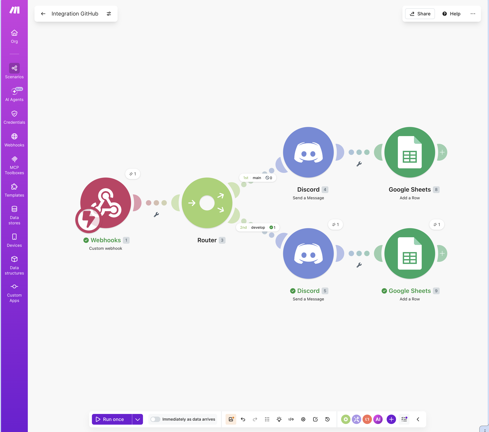
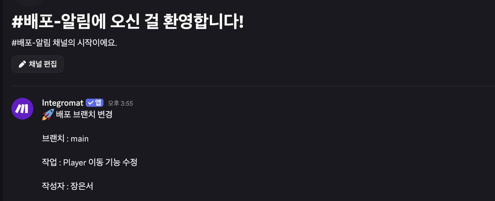
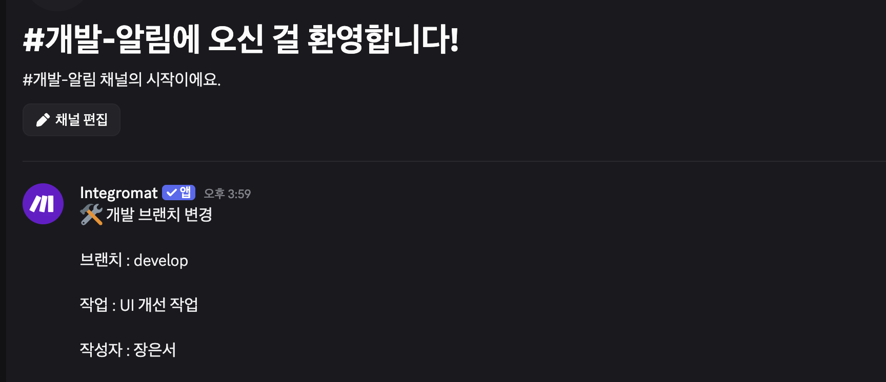
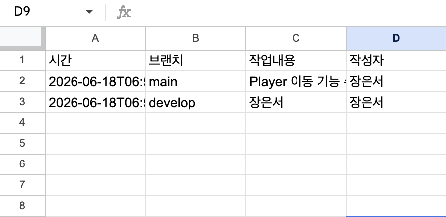

# 프로젝트 2. 자유 주제 자동화 설계 및 구현

## 1. 프로젝트 개요

### 1.1 프로젝트 주제

본 프로젝트에서는 **Unity 개발 이력 자동 기록 및 Discord 알림 시스템**을 구현하였다.

Unity 프로젝트를 개발하면서 작업 내용을 팀원에게 공유하고 개발 이력을 기록하는 과정은 반복적으로 발생한다. 일반적으로 작업자가 직접 Discord에 작업 내용을 작성하고 별도의 문서나 스프레드시트에 기록해야 한다.

이를 개선하기 위해 Webhook을 통해 작업 정보를 전달하면 브랜치에 따라 자동으로 Discord 채널에 알림을 전송하고 Google Sheets에 개발 이력을 기록하는 자동화 시스템을 구축하였다.

---

## 2. 자동화 대상 업무 정의

### 2.1 기존 업무 방식

Unity 프로젝트를 진행할 경우 다음과 같은 반복 업무가 발생한다.

1. 작업 내용을 정리한다.
2. Discord 채널에 직접 공유한다.
3. 작업 이력을 별도로 기록한다.
4. 추후 작업 내역을 다시 찾아본다.

위 과정은 프로젝트가 진행될수록 반복 횟수가 증가하며 누락 가능성이 존재한다.

---

### 2.2 자동화 목표

작업 정보가 입력되면 자동으로 Discord 채널에 알림을 전송하고 Google Sheets에 기록하여 개발 이력을 체계적으로 관리하는 것을 목표로 한다.

---

## 3. 자동화 도구 선정

### 3.1 선정 도구

**Make**

---

### 3.2 선정 이유

1. Webhook을 통한 외부 데이터 수신이 가능하다.
2. Router를 이용한 조건 분기 구현이 쉽다.
3. Discord 연동을 지원한다.
4. Google Sheets 연동을 지원한다.
5. 시각적인 워크플로우 구성이 가능하다.
6. 무료 플랜으로 구현이 가능하다.

---

## 4. 워크플로우 설계

### 4.1 전체 흐름

1. Webhook으로 작업 정보가 전달된다.
2. Make가 데이터를 수신한다.
3. 브랜치 정보를 확인한다.
4. Router를 통해 브랜치별로 분기한다.
5. Discord 채널에 작업 알림을 전송한다.
6. Google Sheets에 개발 이력을 기록한다.

---

### 4.2 워크플로우 다이어그램

```text
Webhook 수신
      ↓
브랜치 확인
      ↓
 ┌─────────────┬─────────────┐
 │             │             │
main 브랜치   develop 브랜치
 │             │
 ↓             ↓
Discord      Discord
알림         알림
 │             │
 ↓             ↓
Google       Google
Sheets       Sheets
기록          기록
```

---

## 5. 구현 내용

### 5.1 Trigger

**Webhooks – Custom Webhook**

외부에서 전달된 JSON 데이터를 수신하면 자동화가 시작되도록 설정하였다.

---

### 5.2 Router (조건 분기)

수신된 데이터의 branch 값을 기준으로 다음과 같이 분기하였다.

* main 브랜치
* develop 브랜치


---

### 5.3 Action

#### (1) main 브랜치

* Discord 알림 전송
* Google Sheets 기록

#### (2) develop 브랜치

* Discord 알림 전송
* Google Sheets 기록

---

### 5.4 구현 화면



---

## 6. 실행 결과

### 6.1 테스트 케이스 1 (main 브랜치)

#### 입력 데이터

```json
{
  "branch": "main",
  "message": "Player 이동 기능 수정",
  "author": "장은서"
}
```

#### 실행 결과

* main 브랜치 Discord 채널 알림 전송
* Google Sheets 기록 완료

#### 결과 화면




---

### 6.2 테스트 케이스 2 (develop 브랜치)

#### 입력 데이터

```json
{
  "branch": "develop",
  "message": "UI 개선 작업",
  "author": "장은서"
}
```

#### 실행 결과

* develop 브랜치 Discord 채널 알림 전송
* Google Sheets 기록 완료

#### 결과 화면





---

## 7. 자동화 효과

1. 개발 이력을 자동으로 기록할 수 있다.
2. 작업 내용을 실시간으로 공유할 수 있다.
3. 수작업 보고 과정을 줄일 수 있다.
4. 프로젝트 진행 상황을 쉽게 추적할 수 있다.
5. 반복 업무를 자동화하여 관리 효율을 높일 수 있다.

---

## 8. 최종 의견

본 프로젝트를 통해 Webhook, Discord, Google Sheets를 연동한 자동화 시스템을 구현할 수 있었다.

특히 Trigger, Router, Action을 활용하여 데이터를 수신하고 조건에 따라 분기 처리하는 과정을 직접 설계하면서 노코드 자동화 도구의 동작 원리를 이해할 수 있었다.

또한 동일한 데이터가 Discord 알림과 Google Sheets 기록으로 동시에 활용되는 과정을 통해 실제 업무 환경에서 적용 가능한 자동화 워크플로우를 경험할 수 있었다.

향후에는 생성형 AI를 연동하여 작업 내용을 자동 요약하거나 개발 일지를 자동 생성하는 기능으로 확장할 수 있을 것으로 기대된다.

## 9. 심층 인터뷰
### 9.1 트리거 불안정 및 외부 연동 실패 대응 방안

본 프로젝트는 GitHub 저장소에 Push 이벤트가 발생하면 Webhook을 통해 자동화가 실행되는 구조이다. 그러나 네트워크 문제나 API 장애로 인해 이벤트 수신 또는 Discord 알림 전송이 실패할 수 있다.

이를 해결하기 위해 다음과 같은 방안을 적용할 수 있다.

모니터링
자동화 실행 결과를 로그로 기록한다.
실행 성공 및 실패 횟수를 주기적으로 확인한다.
Discord 또는 이메일을 이용하여 오류 발생 시 관리자에게 알림을 전송한다.
재시도(Retry)
GitHub API 호출 또는 Discord Webhook 전송 실패 시 일정 시간 후 자동 재시도한다.
예를 들어 5초 → 30초 → 1분 간격으로 최대 3회 재시도하도록 설정할 수 있다.
대체 경로(Fallback)
Discord 전송 실패 시 이메일 알림을 대신 전송한다.
Webhook 수신 실패 시 GitHub API를 주기적으로 조회하는 Polling 방식을 보조 수단으로 활용할 수 있다.

이를 통해 일시적인 장애 상황에서도 알림 누락을 최소화할 수 있다.

### 9.2 조건 분기 증가 시 워크플로우 구조화 방안

현재 프로젝트는 단순히 GitHub 변경사항을 감지하여 Discord로 전달하는 구조이다.

만약 향후 다양한 이벤트를 처리해야 한다면 조건 분기가 증가하게 된다.

예시

Push 이벤트
Pull Request 생성
Pull Request 병합
Release 생성
Issue 등록

이 경우 하나의 긴 워크플로우에 모든 조건을 작성하면 유지보수가 어려워진다.

따라서 다음과 같이 모듈화할 수 있다.

이벤트 처리 모듈 분리
GitHub 이벤트 수신
│
├─ Push 처리 모듈
├─ Pull Request 처리 모듈
├─ Release 처리 모듈
└─ Issue 처리 모듈
공통 기능 재사용

각 모듈에서 사용하는 기능을 별도로 분리한다.

메시지 생성 함수
Discord 전송 함수
오류 처리 함수
로그 기록 함수

이를 통해 새로운 이벤트가 추가되더라도 기존 구조를 수정하지 않고 모듈만 추가하여 확장할 수 있다.

### 9.3 노코드 자동화의 한계와 코딩 기반 자동화 확장 아이디어
노코드 자동화의 한계

노코드 자동화는 단순한 이벤트 감지 및 알림 전송에는 적합하지만 복잡한 데이터 분석에는 한계가 있다.

예를 들어 GitHub 저장소의 변경 내용을 분석하여 다음 정보를 자동으로 생성하는 기능은 구현이 어렵다.

변경 파일 종류 분석
코드 변경량 통계
커밋 품질 평가
개발 진행률 분석

이러한 작업은 복잡한 로직과 데이터 처리가 필요하기 때문이다.

코딩 기반 자동화 확장 아이디어

Python 기반 자동화 서버를 구축하여 GitHub API와 AI 모델을 연동할 수 있다.

확장 예시는 다음과 같다.

GitHub 변경사항 수집
변경 파일 및 코드 분석
AI를 활용한 변경사항 요약 생성
Discord에 자동 보고서 전송

예시 메시지

[프로젝트 변경 보고]

- 수정 파일: 5개
- 추가 코드: 320줄
- 삭제 코드: 85줄

AI 요약:
플레이어 이동 시스템의 충돌 처리 로직이 개선되었으며
인벤토리 UI 관련 버그가 수정되었습니다.

이와 같은 기능은 단순 알림 수준을 넘어 프로젝트 관리 및 협업 지원 도구로 발전시킬 수 있으며, 노코드 자동화의 한계를 보완하는 확장 방안이 될 수 있다.
