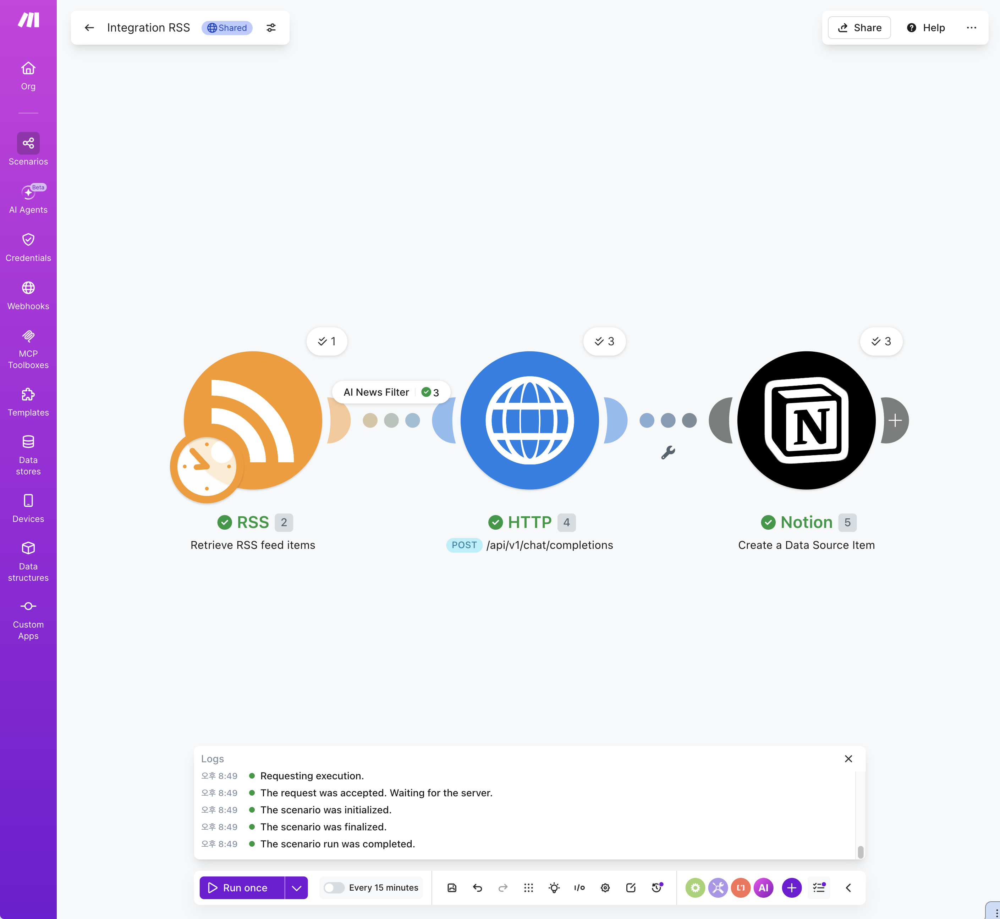
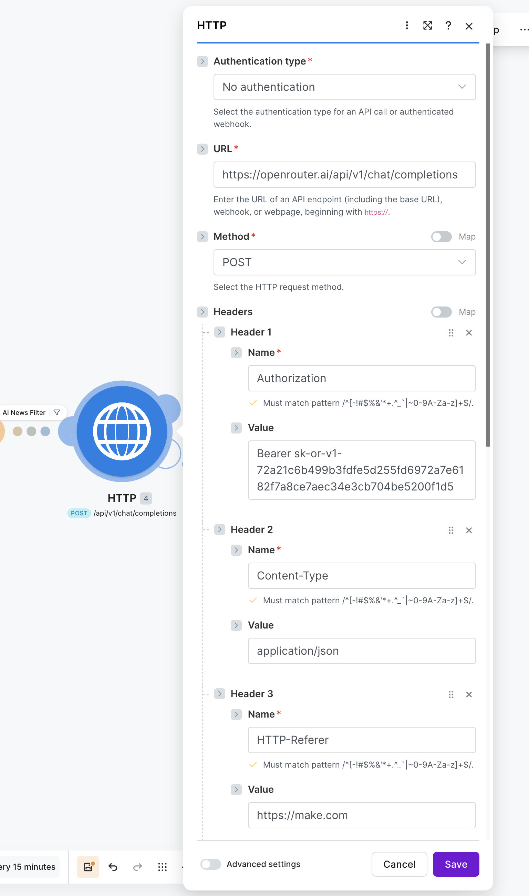
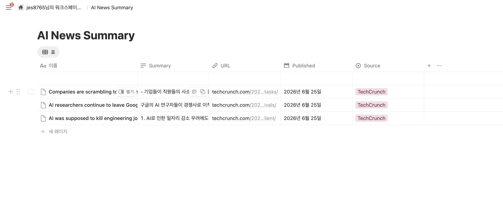
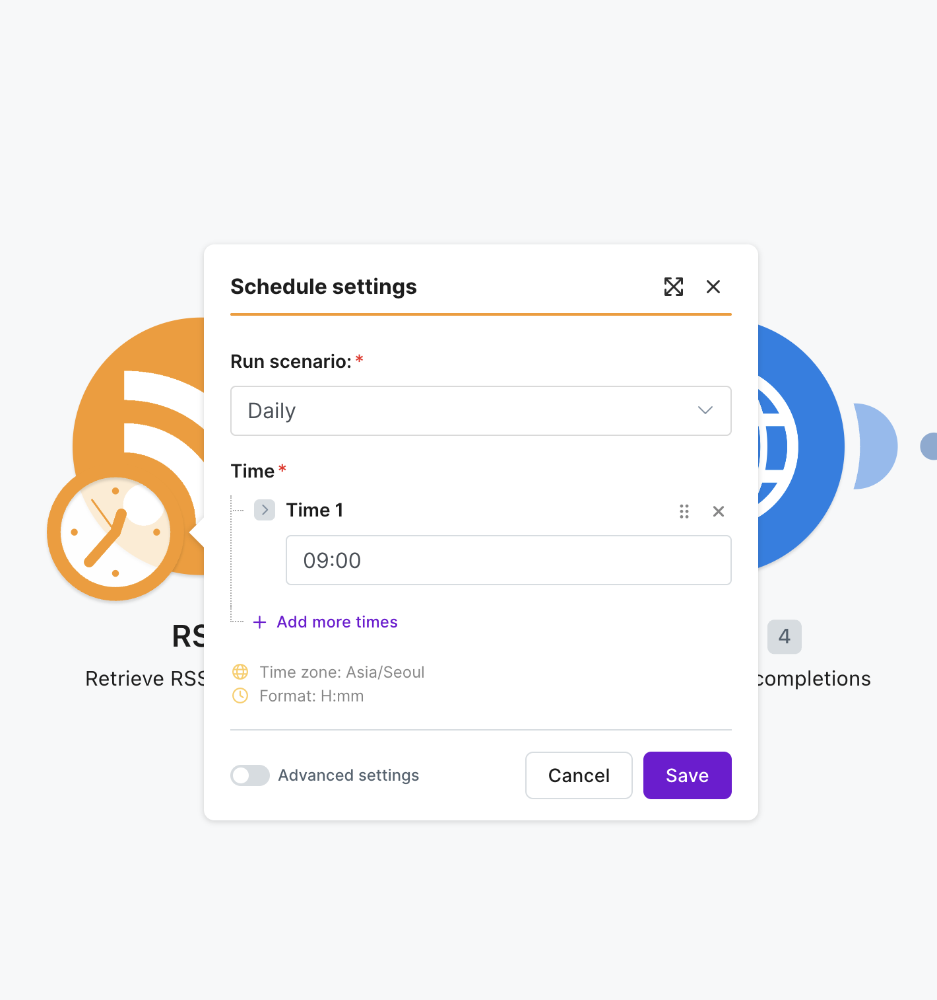

# 프로젝트 3. RSS 기반 AI 뉴스 요약 자동화 시스템

## 1. 프로젝트 개요

### 1.1 프로젝트 주제

본 프로젝트에서는 **RSS 기반 AI 뉴스 요약 자동화 시스템**을 구현하였다.

기술 뉴스 사이트의 RSS 피드를 통해 최신 뉴스를 자동으로 수집하고, AI 관련 기사만 선별한 뒤 생성형 AI를 이용하여 핵심 내용을 3줄 이내로 요약하고, 최종 결과를 Notion 데이터베이스에 자동 저장하는 자동화 파이프라인을 구축하였다.

본 프로젝트는 Make를 활용하여 코드 작성 없이 데이터 수집, AI 요약, 데이터 저장 과정을 하나의 워크플로우로 연결하는 것을 목표로 한다.

---

## 2. 사용 도구

| 구분      | 사용 도구                    |
| ------- | ------------------------ |
| 자동화 플랫폼 | Make                     |
| RSS 제공  | TechCrunch RSS           |
| 생성형 AI  | OpenRouter (DeepSeek V3) |
| 협업 도구   | Notion                   |
| 자동 실행   | Make Scheduler           |

---

## 3. 전체 워크플로우

```
Scheduler (매일 09:00)
        ↓
RSS Feed 수집
        ↓
AI 뉴스 필터링
        ↓
DeepSeek V3 뉴스 요약
        ↓
Notion 데이터베이스 저장
```



---

## 4. 구현 과정

### 4.1 RSS 뉴스 수집

최신 기술 뉴스를 제공하는 TechCrunch RSS를 사용하였다.

RSS 주소

```
https://techcrunch.com/feed/
```

RSS에서 다음 정보를 가져온다.

* 기사 제목(Title)
* 기사 링크(URL)
* 발행일(Published Date)
* 기사 본문(Description)


---

### 4.2 AI 기사 필터링

RSS에는 AI 외에도 다양한 기술 뉴스가 포함되므로 Filter 기능을 이용하여 AI 관련 기사만 통과하도록 설정하였다.

#### 사용 키워드

* AI
* Artificial Intelligence
* OpenAI
* GPT
* Gemini
* Claude
* Anthropic
* LLM
* Copilot

제목 또는 기사 본문에 위 키워드가 포함된 기사만 다음 단계로 전달한다.


---

### 4.3 생성형 AI 요약

필터를 통과한 기사는 OpenRouter API를 통해 DeepSeek V3 모델로 전달된다.

프롬프트는 다음과 같이 구성하였다.

```
다음 기술 뉴스를 한국어로 3줄 이내로 요약하세요.

조건
- 핵심 내용만 작성
- 최대 3줄
- 한국어로 작성
```

생성된 요약은 이후 Notion 데이터베이스에 저장된다.



---

### 4.4 Notion 자동 저장

요약 결과를 Notion 데이터베이스에 자동 저장하도록 구현하였다.

저장되는 정보는 다음과 같다.

| 속성        | 내용         |
| --------- | ---------- |
| Title     | 기사 제목      |
| Summary   | AI 요약      |
| URL       | 원문 링크      |
| Published | 기사 발행일     |
| Source    | TechCrunch |



---

## 5. 자동 실행

Scheduler를 이용하여 매일 오전 9시에 자동 실행되도록 설정하였다.

* 실행 주기 : Daily
* 실행 시간 : 09:00
* Timezone : Asia/Seoul

사람의 개입 없이 RSS 수집부터 AI 요약, Notion 저장까지 자동으로 수행된다.



---

## 6. 주제 필터링 기준

본 프로젝트에서는 AI 관련 뉴스만 수집하기 위해 제목과 기사 본문을 기준으로 키워드 필터링을 수행하였다.

### 선택 이유

TechCrunch RSS는 AI뿐 아니라 스타트업, 모바일, 반도체, 보안 등 다양한 분야의 기사를 함께 제공한다.

따라서 AI 관련 키워드를 기준으로 필터링하여 프로젝트 목적에 맞는 뉴스만 자동으로 선별하도록 구현하였다.

---

## 7. 예외 처리 정책

자동화 과정에서 오류가 발생할 경우 Make의 Error Handler를 사용하여 예외를 처리하였다.

### 적용 내용

* HTTP(OpenRouter) 요청 실패 시

  * 최대 2회 재시도
  * 재시도 간격 : 15분

이를 통해 일시적인 API 오류나 네트워크 문제 발생 시 자동 복구가 가능하도록 설계하였다.

※ 동일 기사 중복 저장 방지는 권장 기능으로 안내되어 있으나, 본 프로젝트에서는 핵심 기능 구현을 우선하였다.

---

## 8. 개인 작업 내용

* TechCrunch RSS 선정 및 테스트
* Notion 데이터베이스 설계
* Make 워크플로우 구현
* AI 뉴스 필터 구성
* OpenRouter(DeepSeek V3) 연동
* Notion 자동 저장 구현
* Scheduler 및 Error Handler 설정
* 전체 시스템 테스트

---

## 9. 테스트 결과

| 테스트 항목           | 결과 |
| ---------------- | -- |
| RSS 뉴스 수집        | 성공 |
| AI 기사 필터링        | 성공 |
| DeepSeek V3 요약   | 성공 |
| Notion 저장        | 성공 |
| Scheduler 자동 실행  | 성공 |
| Error Handler 동작 | 성공 |

---

## 10. 프로젝트 결과

본 프로젝트를 통해 RSS 기반 뉴스 수집, AI 기사 필터링, 생성형 AI를 활용한 자동 요약, Notion 자동 저장까지 하나의 자동화 시스템을 구현하였다.

Make를 활용하여 별도의 프로그래밍 없이 자동화 파이프라인을 설계하고 구현하는 과정을 경험할 수 있었으며, 다양한 외부 서비스(RSS, OpenRouter, Notion)를 연동하는 방법을 학습할 수 있었다.
