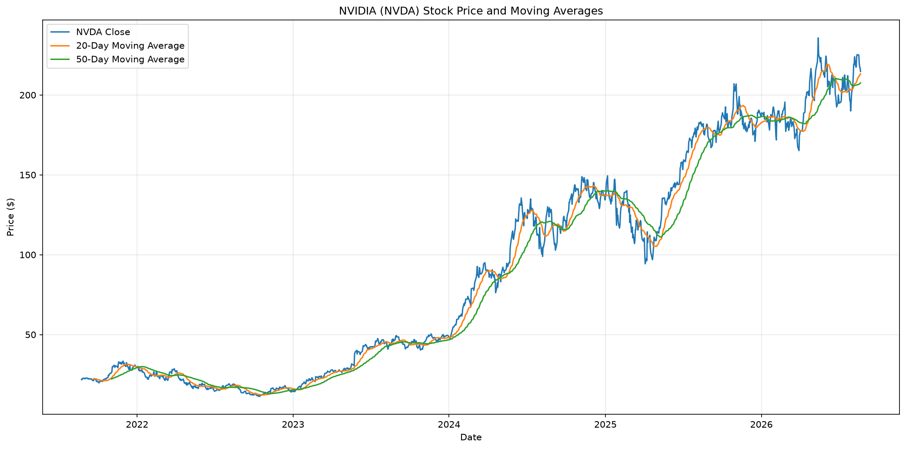
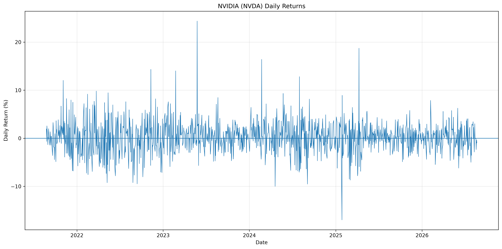
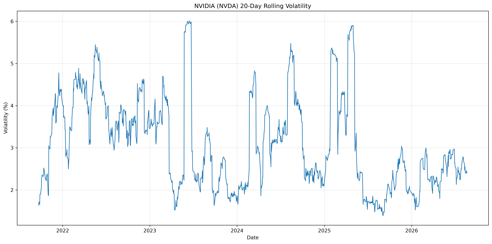
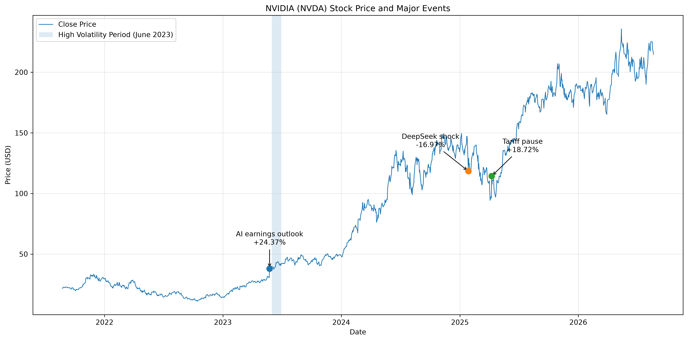

# NVIDIA(NVDA) 주가 시계열 분석

## 1. 프로젝트 소개

2021년 8월부터 2026년 8월까지의 NVIDIA(NVDA) 일별 주가 데이터를 분석하여 주가의 장기적인 추세와 급등·급락 구간, 변동성을 확인하고 주요 가격 변동 시점의 외부 사건을 함께 살펴본 시계열 분석 프로젝트입니다.

단순히 주가 그래프를 확인하는 것에서 끝나지 않고, 데이터에서 큰 변동이 발생한 시점을 찾은 뒤 당시의 사건과 연결하여 그 의미를 해석하는 것을 목표로 하였습니다.

## 2. 분석 내용

다음과 같은 질문을 중심으로 분석하였습니다.

1. NVIDIA 주가는 전체 분석 기간 동안 어떤 장기적인 추세를 보였는가?
2. NVIDIA 주가의 급등 및 급락은 언제 발생했는가?
3. 주가의 변동성이 특히 높았던 시기는 언제였는가?
4. 큰 가격 변동이 발생한 시점에는 어떤 외부 사건이 있었으며, 이를 주가 움직임과 어떻게 연결하여 해석할 수 있는가?

### 주요 분석 방법

- 20일 이동평균
- 50일 이동평균
- 일별 수익률
- 20일 Rolling Volatility
- 주요 급등·급락 구간 및 외부 사건 비교

## 3. 데이터

- 대상: NVIDIA Corporation (NVDA)
- 기간: 2021-08-24 ~ 2026-08-21
- 데이터 포인트: 1,254개
- 단위: 거래일
- 주요 가격 지표: 종가(Close/Last)

### 데이터 컬럼

| 컬럼 | 설명 |
|---|---|
| Date | 거래 날짜 |
| Close/Last | 종가 |
| Volume | 거래량 |
| Open | 시가 |
| High | 고가 |
| Low | 저가 |

데이터의 결측치와 중복 날짜를 확인하였으며, 거래일이 아닌 주말 및 미국 증시 휴장일은 결측치로 처리하지 않았습니다.

자세한 데이터 검증 및 전처리 과정은 `REPORT.md`와 `analysis.ipynb`에서 확인할 수 있습니다.

## 4. 시각화

### 주가 및 이동평균



### 일별 수익률



### 20일 Rolling Volatility



### 주요 사건과 주가 변동



## 5. 주요 분석 결과

| 날짜/기간 | 주요 관찰 |
|---|---|
| 2023-05-25 | 일별 수익률 +24.37%, 분석 기간 중 최대 상승 |
| 2023년 6월 | 20일 Rolling Volatility가 높은 수준으로 지속 |
| 2025-01-27 | 일별 수익률 -16.97%, 분석 기간 중 최대 하락 |
| 2025-04-09 | 일별 수익률 +18.72%, 분석 기간 중 두 번째로 큰 상승 |

각 변동 구간에 대한 외부 사건과 해석은 `REPORT.md`에서 자세하게 다룹니다.

## 6. 프로젝트 구조

```text
M1-1/
├── data/
│   └── stock_data.csv
├── images/
│   ├── 01_price_moving_average.png
│   ├── 02_daily_return.png
│   ├── 03_volatility.png
│   └── 04_major_events.png
├── analysis.ipynb
├── REPORT.md
├── README.md
└── requirements.txt
```

## 7. 실행 환경

- Python 3.12
- pandas
- matplotlib
- Jupyter Notebook
- ipykernel

## 8. 실행 방법

### 1. 가상환경 생성

    python -m venv .venv

### 2. 가상환경 활성화

macOS / Linux:

    source .venv/bin/activate

Windows:

    .venv\Scripts\activate

### 3. 라이브러리 설치

    pip install -r requirements.txt

### 4. Jupyter Notebook 실행

    jupyter notebook

또는 VS Code에서 `analysis.ipynb`를 열어 실행할 수 있습니다.

Notebook의 셀을 위에서부터 순서대로 실행하면 데이터 전처리, 시계열 분석 및 시각화 결과를 재현할 수 있습니다.

## 9. 상세 리포트

분석 과정, 데이터 전처리, 시계열 분석 방법, 시각화 결과, 주요 인사이트, 결론 및 한계점은 `REPORT.md`에서 확인할 수 있습니다.

## 10. AI 활용

본 프로젝트에서는 AI를 활용하여 Python 분석 코드 작성, 시계열 분석 방법 탐색, 시각화 구현 및 분석 결과의 해석 방향을 검토하였습니다.

AI가 제안한 코드와 분석 결과는 직접 실행하고 원본 데이터와 비교하여 검증하였으며, 최종적인 데이터 해석과 결론은 분석 결과를 바탕으로 직접 판단하였습니다.

자세한 AI 사용 로그는 `REPORT.md`에서 확인할 수 있습니다.


- 데이터 출처: Nasdaq - NVIDIA Corporation (NVDA) Historical Quotes
- 데이터 기간: 2021-08-24 ~ 2026-08-21
